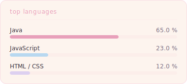
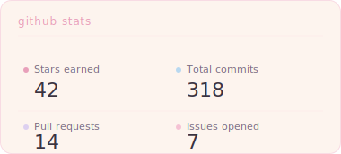

<!--
  sophie's github profile readme
  matching: shvquu.de
-->

# Hi, I'm Sophie 🌸

**Registered Nurse · Pediatrics** &nbsp;|&nbsp; **Frontend & Java Developer**  
📍 Near Cologne, Germany 🇩🇪 &nbsp;·&nbsp; she/her 🏳️‍⚧️

---

🏥 &nbsp;Caring for kids by day &nbsp;·&nbsp; 💻 Building the web by night  
🌱 &nbsp;Currently working on **Flux Browser** & **VoxelClient**  
☕ &nbsp;Coding in **Java**, **JavaScript** & **HTML/CSS**  
💬 &nbsp;Ask me about pediatric nursing, browser engines or Minecraft modding  
📫 &nbsp;Reach me on Discord: [@shvquu](https://discord.gg/unionmc)  
🔗 &nbsp;**Website**: [shvquu.de](https://shvquu.de/)  
🛠️ &nbsp;**Organization**: [@VoxelLabs](https://github.com/voxellabs-minecraft)

---

### 🚀 Projects

| Project | Description | Stack |
|---|---|---|
| 🌐 **Flux Browser** | A clean, minimal custom browser | Java · JS · HTML/CSS |
| ⛏️ **VoxelClient** | Minecraft 1.21.4 client mod | Java · Minecraft API |

---

&nbsp;&nbsp;

